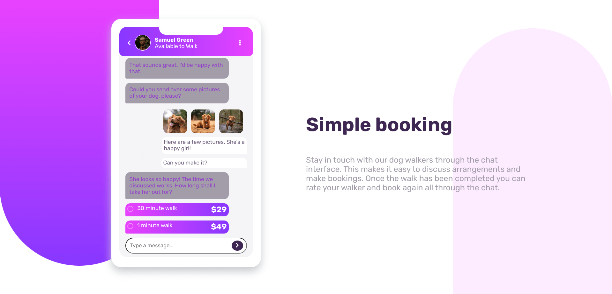
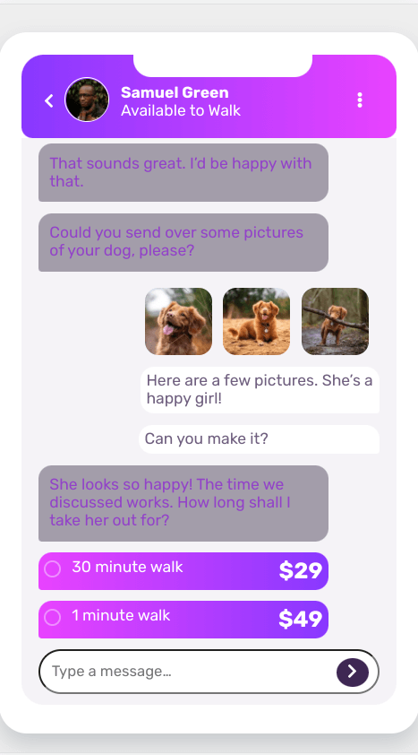
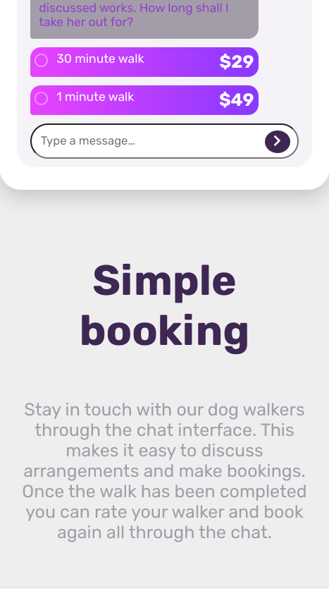

# Frontend Mentor - Chat app CSS illustration solution

This is a solution to the [Chat app CSS illustration challenge on Frontend Mentor](https://www.frontendmentor.io/challenges/chat-app-css-illustration-O5auMkFqY). Frontend Mentor challenges help you improve your coding skills by building realistic projects.

## Table of contents

- [Overview](#overview)
  - [The challenge](#the-challenge)
  - [Screenshot](#screenshot)
  - [Links](#links)
- [My process](#my-process)
  - [Built with](#built-with)
  - [What I learned](#what-i-learned)
  - [Continued development](#continued-development)
  - [Useful resources](#useful-resources)

## Overview

### The challenge

Users should be able to:

- View the optimal layout for the component depending on their device's screen size
- **Bonus**: See the chat interface animate on the initial load

### Screenshot

### Links

- Live Site URL: [Github Pages](https://jdegand.github.io/chat-app-css-illustration)

## My process

### Built with

- CSS custom properties
- Flexbox
- Font Awesome

### What I learned

### Continued development

- Tough to squeeze everything in.
- Tough to determine the height of the phone.
- On Mobile, left phone larger and eliminated background.
- Have to tweak for *most* screen sizes.

### Useful resources

- [Font Awesome Icons](https://fontawesome.com/v5.15/icons?d=gallery&p=2)
- [MDN Docs](https://developer.mozilla.org/en-US/docs/Web/CSS/color_value/hsla) - hsla
